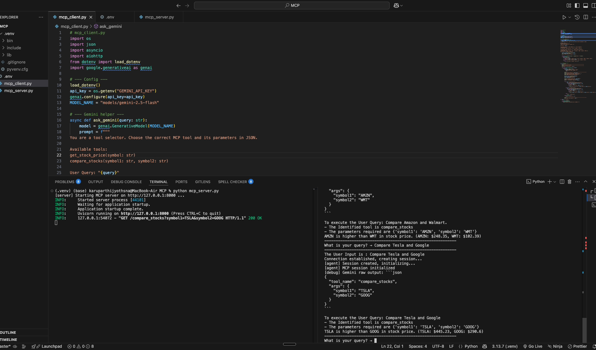

# Model Context Protocol (MCP) – Client–Server Demo

This project demonstrates how **LLMs can use the Model Context Protocol (MCP)** to securely connect with external tools and data sources.

## Features
- **FastAPI MCP Server** exposing stock data tools (`get_stock_price`, `compare_stocks`)
- **Async Python MCP Client** using **Gemini 2.5 Flash**
- **Real-time finance data** via `yfinance`
- **Secure .env configuration** for API keys

## Architecture
```
[ Gemini 2.5 Flash ] ⇄ [ MCP Client ] ⇄ [ MCP Server (FastAPI) ] ⇄ [ Yahoo Finance API ]
```

## Setup
1. Create a `.env` file:
   ```bash
   GEMINI_API_KEY=your_api_key_here
   ```
2. Install dependencies:
   ```bash
   pip install fastapi uvicorn aiohttp yfinance python-dotenv google-generativeai
   ```
3. Run the server:
   ```bash
   python mcp_server.py
   ```
4. In another terminal, run the client:
   ```bash
   python mcp_client.py
   ```

## Example Queries
- `What's the stock price of Walmart?`
- `Compare Amazon and Tesla.`
- `What's the price of Meta?`
  
<p align="center">
  
 </p>
 
## Learnings
- Built a complete **LLM toolchain using MCP**
- Implemented **real-time API integrations**
- Understood **client-server orchestration** and **security principles**

---

### Author
**Jyothsna Karuparthi**  
*Exploring Agentic AI & Secure System Architecture*  
📍 [linkedin.com/in/karuparthi-jyothsna](https://linkedin.com/in/karuparthi-jyothsna)
